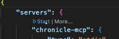
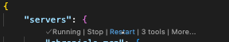

# Chronicle.MCP

[](https://discord.gg/kt4AMpV8WV)
[](https://hub.docker.com/r/cratis/chronicle-mcp)
[](https://github.com/Cratis/Chronicle.Mcp/actions/workflows/build.yml)
[](https://github.com/Cratis/Chronicle.Mcp/actions/workflows/publish.yml)

## Using

The Chronicle MCP server leverages Stdio and is packaged as a container.
In your tool, configure it using that.

> Note: You must have a Chronicle server running.

### Example: VSCode

In VSCode you would do this by adding a tool to your agent.
This can done either by adding it to the global user settings or through an `mcp.json` file in
the `.vscode` folder of your project.

For the global user settings, you simply do the following:

```json
"mcp": {
    "servers": {
        "Chronicle": {
            "type": "stdio",
            "command": "docker",
            "args": [
                "run",
                "-i",
                "--rm",
                "-eCratis__Chronicle__Mcp__ConnectionString=chronicle://host.docker.internal:35000",
                "cratis/chronicle-mcp"
            ]
        }
    }
}
```

> Note: To configure the connection string for Chronicle you pass it an environment variable; `Cratis__Chronicle__Mcp__ConnectionString``
> running locally - on MacOS and Windows the host machine is found at `host.docker.internal`.

For a local `mcp.json` file, its almost the same:

```json
{
    "servers": {
        "Chronicle": {
            "type": "stdio",
            "command": "docker",
            "args": [
                "run",
                "-i",
                "--rm",
                "cratis/chronicle-mcp"
            ],
            "env": {
                "Cratis__Chronicle__Mcp__ConnectionString": "chronicle://host.docker.internal:35000"
            }
        }
    }
}
```

You can see this in action in the [mcp.json](./.vscode/mcp.json) in this repository.

> Note: The `cratis/chronicle-mcp` is a multi CPU architecture image supporting both x64 and arm64 automatically.

## Prompts / Tools

### Event Types

You can ask it things like:

- List all event types in the [put name here] event store

### Observers

- List all observers in the [put name here] event store
- List all observers in the [put name here] event store and namespace [put namespace here]

## Local development

Using VSCode, the [mcp.json](./.vscode/mcp.json) in the `.vscode` folder of this repository is automatically supported.
Open it and click the **Start** button:



During development, compile and click the **Restart** button when having the `mcp.json` open:


